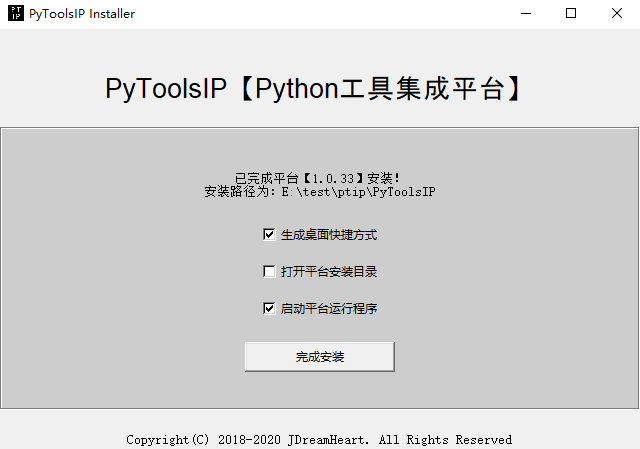

# 平台安装指南

----
## 注意事项
  * 当前平台**仅支持`Windows`系统**。
  * 安装及初次运行平台程序时，必须**确保网络正常连接**。

## 1. 下载安装程序
  * 通过浏览器打开[平台官网首页](https://ptip.jdreamheart.com)，直接点击【**下载安装程序**】按钮进行下载。

## 2. 运行安装程序
  * 下载完成后，双击运行安装程序。

### 2.1 选择安装版本
  * 点击下拉框，选择需要安装的平台版本（具体版本信息，可在[PyToolsIP平台版本](https://ptip.jdreamheart.com#平台版本)中查看）。

### 2.2 选择安装路径
  * 点击选择路径按钮，选择所要安装的目标路径。

需要注意的是：**安装路径不能包含`PyToolsIP`文件夹**。  
  
### 2.3 选择PIP安装镜像
  * 点击下拉框，选择`PIP`安装镜像，在安装`Python`模块时，会使用该配置进行`PIP`安装。
  * 国内环境可选择除默认镜像外的选项，如阿里云镜像。
  * 在安装完成后的平台程序中，可以修改`PIP`安装镜像的配置值。

### 2.4 点击安装按钮
  * 点击确认安装按钮，安装程序会自动下载平台包及相关依赖包，并进行解压安装。

## 3. 安装结果
  * 如果安装失败，请查看是否是因网络异常而导致的下载失败；除此之外的原因，请将异常信息反馈到官方邮箱。
  * 如果安装成功，点击【**完成安装**】按钮，此次安装完成。

  

**需要注意的是：**  
  * 生成桌面快捷方式后，运行该程序的桌面快捷方式，可能会因为运行路径的问题而导致程序运行失败。
  * 完成安装后，通过勾选启动平台运行程序的方式，来启动程序，可能会因某些软件（如`360卫士`）的拦截等原因，导致无法启动程序。

所以最优启动的方式是：**进入程序的安装路径，运行该安装路径下的`pytoolsip.exe`程序。**  