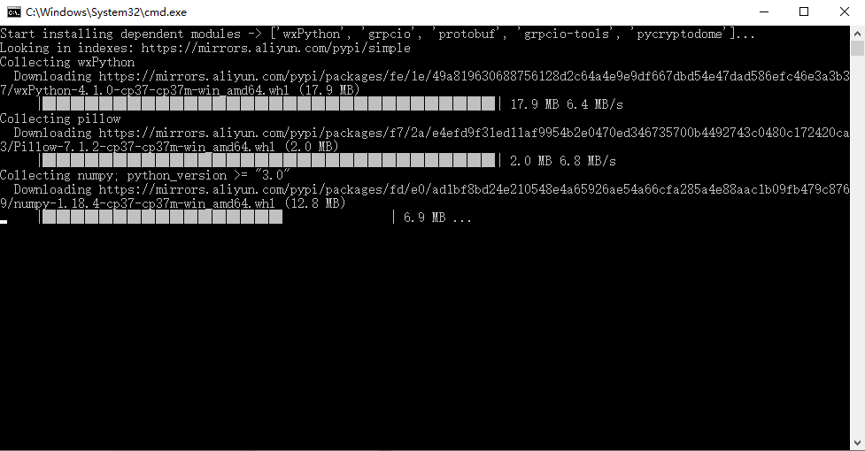

# 平台使用指南

----

## 1. 运行平台
  * 打开安装目录后，双击`pytoolsip.exe`，即可运行平台程序。

**在初次运行平台程序时，平台会安装依赖模块（如下所示），此时需确保网络能正常连接。**  

## 2. 下载工具
用户下载工具方式有两种：  
  * (1) 直接在平台程序的首页，点击工具项，会显示对应的详情弹窗，点击【**下载工具**】按钮即可进行下载。

  

  * (2) 在**网页**[PyToolsIP工具列表](https://ptip.jdreamheart.com/toollist)中搜索工具，复制该工具`ID`后回到平台程序中，点击`工具/下载工具`菜单项，输入ID工具后点击下载，会弹出该工具对应的详情弹窗。

  
**复制工具`ID`后，在平台程序中进行下载：**  
  

## 3. 搜索工具
  * 目前仅支持在网页[PyToolsIP工具列表](https://ptip.jdreamheart.com/toollist)中搜索工具。

### 3.1 搜索所有工具
  * 在搜索所有工具时，支持用户根据**工具名、用户名或工具ID**来搜索工具。

### 3.2 搜索对应类别的工具
  * 目前工具分成三大类，包括**开发工具、用户工具、娱乐工具**。
  

## 4. 评论工具
  * 进入工具详情页，可以对工具进行评分和评论。

注意：**由于目前平台的敏感词屏蔽功能不完善，故暂不开放工具的评论功能。**  
