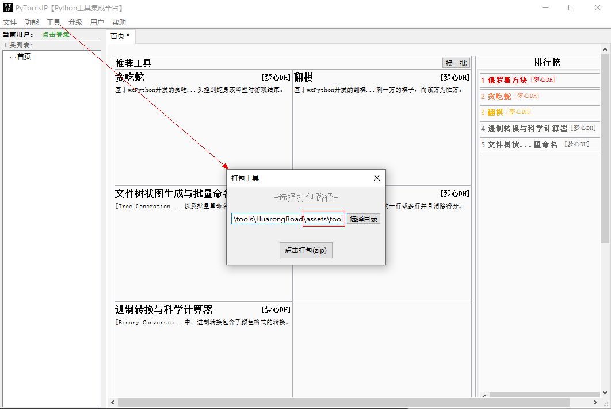

# 工具开发指南

----

## 1. 生成工具模板
点击【**`工具/开发工具`**】菜单项，打开生成工具模板弹窗。（如下所示）  

  

点击【**`创建工具模板`**】按钮，会在对应的工程路径下创建相应名称的工具。  
生成**工具模板的工程结构**如下所示：  

  

## 2. 开发工具步骤
工具开发人员一般在`tool`文件夹下（如上图的红色区域所示）进行内容开发。  

**主要文件解释：**  
  * `MainView`是工具的主视图，可以理解为是工具的界面入口。
  * `_loadtool.py`主要进行工具的加载工作，如需扩展平台的事件或热键功能，需在该文件中进行事件或热键的初始化。
  * `depends.mod`用于配置当前工具的依赖模块，在平台下载及使用该工具时，会先通过`PIP`安装该文件中的依赖模块。

## 3. 运行工具
双击运行`run.bat`，即可单独运行工具。  

需要注意的是：如若遇到窗口一闪而逝的现象，可能是工具运行出现了报错。将`run.bat`中最后的`REM pause`修改为`pause`，再次运行工具，窗口即使遇到报错也会停留，方便查看报错日志。  

## 4. 打包工具
在完成工具开发后，通过平台的【**`工具/打包工具`**】对工具进行打包。  

  

**注意：要选择`tool`文件夹。**  

最终会打包成一个`zip`文件：  

  

## 5. 从本地添加工具包
为了能立刻测试所打的工具包是否正常，或在平台上运行效果是否符合预期，平台程序提供【**`工具/添加本地工具`**】菜单项，允许开发者将本地的工具添加到平台上运行。  

  